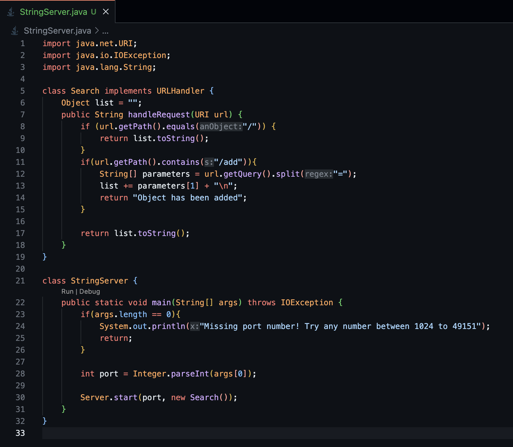
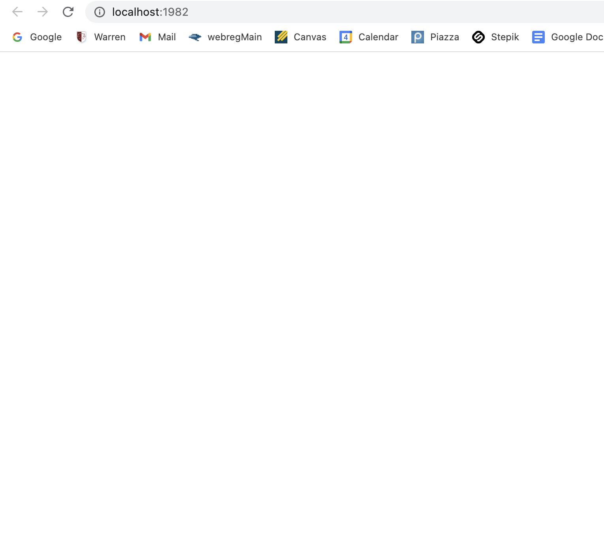
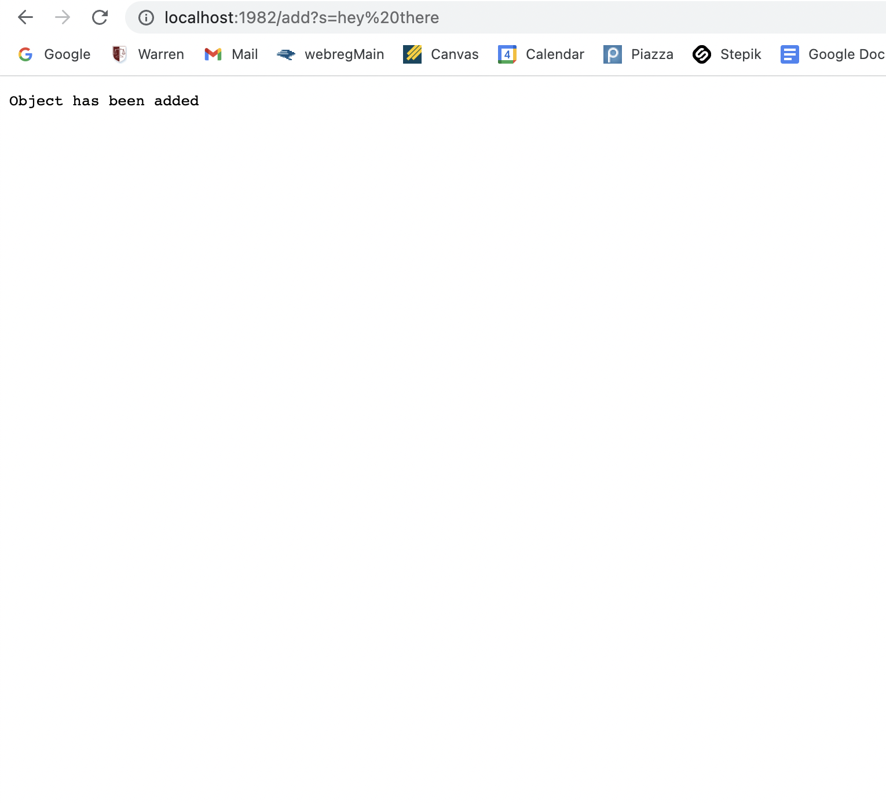
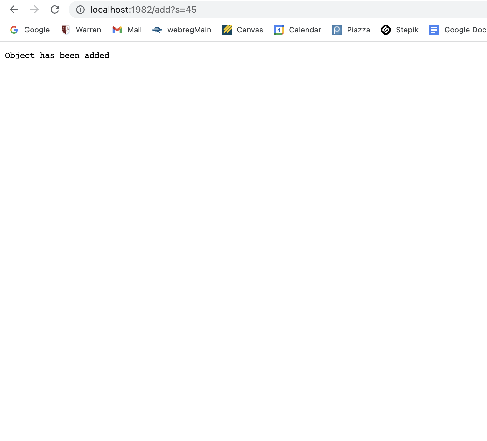
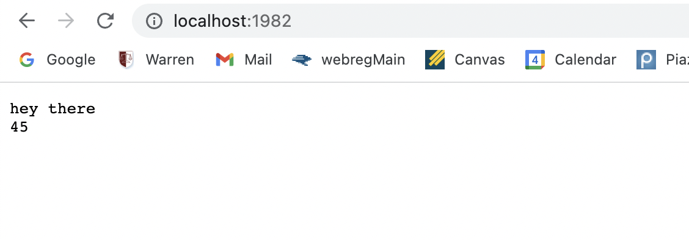

# StringServer (Part 1)
Writing the StringServer was very similar to the code that was given to us in our previous labs. To be more specific,
I used NumberServer.java as a reference point, since the goal with this file is very similar.

The first step to this was to make a an Object that will store the strings. The reason why I decided to go with Object
is to be able to store integers as strings in case we want to include integers in our inputs.This is where the line
 `Object list = "";`comes from.
 After that, we overide the method from the interface "URLHandler". This interface allows us to get the paths of our url
 and use it to split it and be able to add out strings to our Object "list". In order to do this, we get the query and 
 split the "=" so that we get the string after the equals sign and add it to out "list". 
 For example `http://localhost:1982/add?s=hey` needs to add "hey" to our objects. Because we do not want anything before the
 "=", we split and just get "hey". Make sure to put "\n" so the string can go to the next line. 
 
 
 Here is an example:
 
 **Step 1**
 
 Compile the files
 
 
 Compiling will give you the local host which would output this
 
 
 
 After that, you `http://localhost:1982/add?s=hey there` to add the string
 
 
 After that, we can add an int as a string
 
 
 Then, if we just type the root path, we will get the strings we added
 
 
 # Bugs (Part 2)
 
 For this part, I will chose the reverseInPlace
 
 For reverseInPlace, the issue was that when it would the order, by the time we reached the halfway point, it would set the future
 values to values from index 0,1,2... but since those indices were already changed, the value that we need to change would not be
 the numbers we want.To fix this, we had to divide the length by 2 in order to only reach the half point. We then set a temporary
 integer. We set the first index to the last index and after that, we set the last index to the temporary number so we change the
 indices at the same time. 
 
 Here is the code:
 

 
 
 
 
 
 
 

